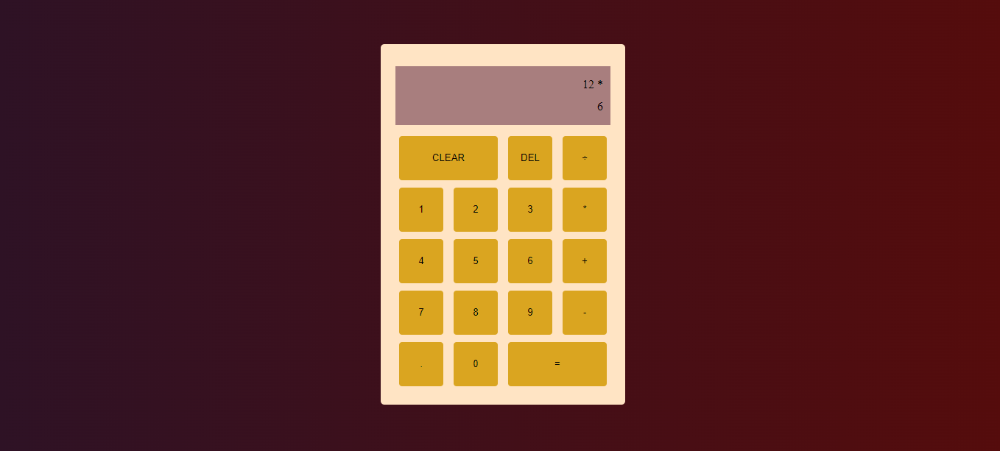

# Calculator
This is a simple calculator design to carry out the basic mathematical computations. This app is program to display the computation on a screen

## Features
This app allow Users to perform basic mathematical operations. Apart from the basic mathematical operators, a delete button and a clear button is also available. Delete button to delete a value while the clear button to clear all values from the screen.

## Images

### inactive state
The below image shows the calculator app in its inactive state.


### active
The below image shows the app in its active state displaying a computation in progress.



## Getting Started

1. Clone the repository to your local machine:

   ```bash
   git clone https://github.com/Mogle7Arkad/Calculator
   ```

2. Open the project folder in your favorite code editor.

3. Locate the `index.html` file and open it in your web browser to use the Weather App.

## Usage

1. Upon opening the app, you will be presented with the user interface.

2. Input your values and press the equality sign to get computed result.

3. If an error is committed and one wish to eliminate an unwanted value, the delete button handles that.

4. The clear button works almost like a refresh or restart button that gives a fresh screen for new computation.

## Contributing

This project is open for contributions. If you find any issues or have suggestions for improvements, feel free to open an issue or create a pull request.

## Acknowledgments

The Odin Project for providing a comprehensive curriculum for web development.

## Built with

JavaScript
HTML
CSS
Visual Studio Code
Git & Github